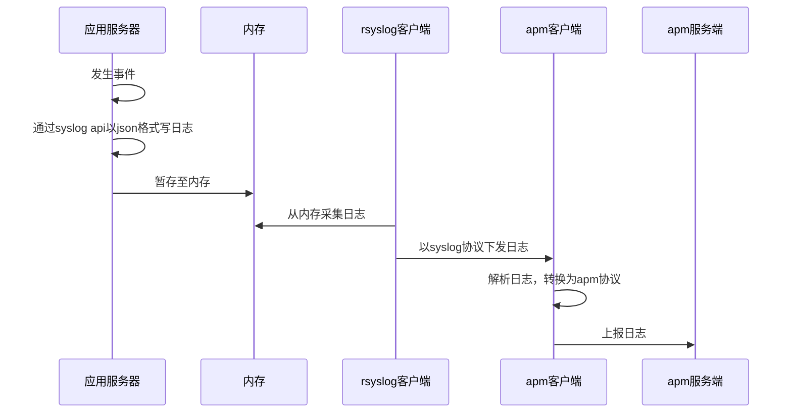

# 索引
* [需求](#需求)
* [选型](#选型)
* 解决方案
  * 部署方案
  * 上报方案

* [协议](#协议)

# 需求

1. 可以自定义指标
1. 可以自定义上报数据
1. 对应用的性能影响尽可能小
1. 非阻塞上报
1. 易于使用，对用户友好
1. 包含前后端解决方案（ui、server）
1. 可以接入告警（邮件、短信、钉钉）
1. 上报端接入成本小
1. 可平行扩容

# 选型

* [ELK APM](https://www.elastic.co/guide/en/kibana/7.1/apm-settings-kb.html)

* [Jaeger](链路追踪方案)

* [Skywalking](链路追踪方案)

# 解决方案

### 部署方案

### 上报方案

# 协议

### 外部服务监控

[上报服务](http://gitlab.hiii-life.com/hiii-big-data/event-tracking.big-data.xgo.com/blob/master/docs/apm_api.md)

* 上报参数

>> 公共参数

  请求方式    | 参数名称          |类型|备注
------------|-----------------|----|----
HEAD        |X-HEAD-APP-VERSION | string|app版本，`1.0.0`
HEAD        |X-HEAD-APP-ID | string| appid 自定义区分客户端的id 乘客：`1001`， 司机：`1002`
HEAD        |X-HEAD-APP-CHANNEL | string|下载app的渠道，官方：`official`，其他渠道后续自行约定
HEAD        |X-HEAD-PHONE-MODEL  | string|设备系统类型: `Apple,iPhone 7 Plus` 
HEAD        |X-HEAD-PLATFORM  | string|设备平台: `iOS`,`Android`,`wap`,`web`,`pc`
HEAD        |X-HEAD-OS-VERSION | string |设备系统版本: `8.0.0`
HEAD        |X-HEAD-DEVICE-ID  | string|设备唯一标识 `device uuid`
HEAD        |X-HEAD-IMEI  | string|设备唯一标识 `imei`
HEAD        |X-HEAD-DEVICE-NETWORK| string|设备网络类型，流量：`2G`,`3G`,`4G`; wifi: `wifi`
HEAD        |X-HEAD-LOCATION-LNG  | string|  用户当前坐标的经度 如：`23.12312312321`
HEAD        |X-HEAD-LOCATION-LAT  | string|  用户当前坐标的纬度 如：`113.11232321`

>> 接口调用监控上报

  请求方式    | 参数名称          |类型|备注
------------|-----------------|----|----
POST        |source | string|来源：`页面url` 或 `app view link`
POST        |reqid | string| 接口的链路id
POST        |connect_duration | int| 连接时长（毫秒）
POST        |wait_duration | int| 等待时长（毫秒）
POST        |url | string| 接口url：api.get99.com/xxxx/xxx 等
POST        |code | string |  状态码：10 +  接口http状态码（3位） + 接口错误码（9位）
POST        |ext | string | 附带信息

>> 资源访问监控上报

  请求方式    | 参数名称          |类型|备注
------------|-----------------|----|----
POST        |source | string|来源：`页面url` 或 `app view link`
POST        |connect_duration | int| 连接时长（毫秒）
POST        |wait_duration | int| 等待时长（毫秒）
POST        |url | string| 接口url：api.get99.com/xxxx/xxx 等
POST        |code | string | 状态码：11 +  接口http状态码（3位）+ 9个0
POST        |ext | string | 附带信息

>> 本地监控上报

  请求方式    | 参数名称          |类型|备注
------------|-----------------|----|----
POST        |source | string|来源：`页面url` 或 `app view link`
POST        |code | string | 状态码：20 +  3个0 + 自定义错误码（9位）
POST        |ext | string | 附带信息

### 内部服务监控

[TODO]

* [ ] 客户端埋点方案
* [ ] syslog中转方案
* [ ] apm上报方案

